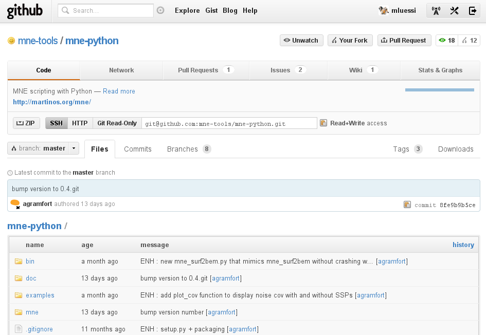
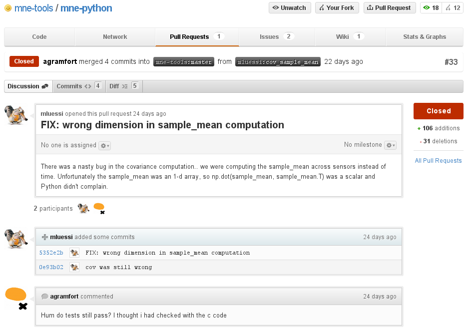
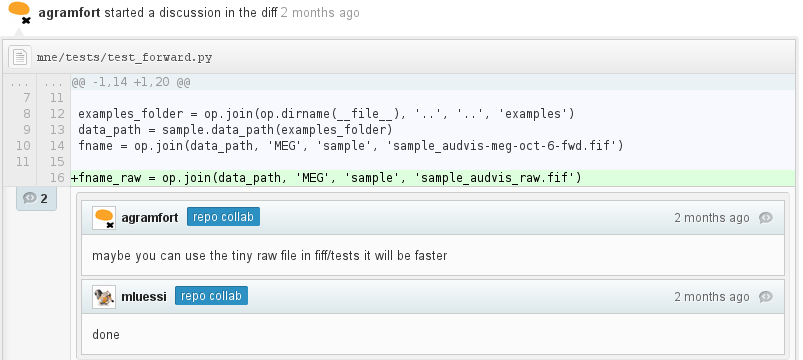

.. raw:: html

    Intro to 
   
   and
   

   
    Martin Luessi
   

Martinos Center Why N How, April 5, 2012

----

..imagine the following scenario:

- You write a data analysis script
- You want to share it with others and collaborate on it

How do you do it?

- Send around e-mails?
- Put the file on a shared drive / dropbox?

Potential problems:

- It is difficult to track changes (someone needs to coordinate)
- What if two collaborators make incompatible changes?
- What if you later find that an earlier version was better?

----

Enter Version Control Systems..
-------------------------------

- Widely used for software development
- Allow multiple people to work on the same files
- Keep track of file changes
- Provide a structured way of integrating changes (branching and merging)
- Work with any type of text file (not binary files like .doc etc.)

Potential uses for scientists:

- Software development
- Data analysis scripts (Python, BASH, Matlab, ...)
- Papers (if they are plain text files, e.g., LaTex)
- Presentations (like this one)

----

What is git?
------------

- git is a **free** and **open source, distributed** version control system
- Originally created by Linus Torvalds in 2005 (Creator of the Linux Kernel)
- It is designed to be fast

Unique features:

- Every **git clone** is a **full repository** with complete history etc.
- It does not have to rely on a centralized server (unlike CVS or SVN)
- **Branching** and **merging** are easy to do and fast

A **repository** contains:

- Files and directories
- A historical record of changes
- A set of commit objects
- A set of heads (references to commit objects)

----

Getting a git Repository
------------------------

Either **create** a new repository:

.. sourcecode:: console

    [$] cd ~/mycode
    [$] git init
    Initialized empty Git repository in /home/martin/mycode/.git/

Or **clone** a repository:

.. sourcecode:: console

   [$] git clone git://github.com/schacon/simplegit.git
   Initialized empty Git repository in /home/martin/simplegit/.git/
   remote: Counting objects: 100, done.
   remote: Compressing objects: 100% (86/86), done.
   remote: Total 100 (delta 35), reused 0 (delta 0)
   Receiving objects: 100% (100/100), 9.51 KiB, done.
   Resolving deltas: 100% (35/35), done.
   [$] ls -al simplegit
   total 24
   drwxr-xr-x 4 martin martin 4096 Apr  4 14:41 .
   drwxr-xr-x 9 martin martin 4096 Apr  4 14:41 ..
   drwxr-xr-x 7 martin martin 4096 Apr  4 14:41 .git
   -rw-r--r-- 1 martin martin  125 Apr  4 14:41 README
   -rw-r--r-- 1 martin martin  592 Apr  4 14:41 Rakefile
   drwxr-xr-x 2 martin martin 4096 Apr  4 14:41 lib

Notice: The ``.git`` directory contains the git repository

----

First Steps: Adding a File
--------------------------

See the **status**

.. sourcecode:: console

   [$] cd ~/mycode
   [$] git status
   # On branch master
   #
   # Initial commit
   #
   nothing to commit (create/copy files and use "git add" to track)

- We are on the **master branch**
- The repository is empty

Let's **add** a file

.. sourcecode:: console

   [$] echo "hello git" >> test.txt
   [$] git add test.txt

----

First Steps: Adding a File Cont.
--------------------------------

See the **status** again

.. sourcecode:: console

   [$] git status
   # On branch master
   #
   # Initial commit
   #
   # Changes to be committed:
   #   (use "git rm --cached <file>..." to unstage)
   #
   #       new file:   test.txt

**commit** all changes

.. sourcecode:: console

   [$] git commit -a -m "my first file"
   [master (root-commit) cb2ff46] my first file
    Committer: martin <martin@think.(none)>
    1 files changed, 1 insertions(+), 0 deletions(-)
    create mode 100644 test.tx

See the **log**

.. sourcecode:: console

   [$] git log
   commit cb2ff4663bdc3bf3d38a0ad534dd770656c45f0d
   Author: martin <martin@think.(none)>
   Date:   Wed Apr 4 15:10:42 2012 -0400
   my first file

----

Making More Changes
-------------------

Make modifications to the file

.. sourcecode:: console

   [$] echo "new content" >> test.txt

See the **difference**

.. sourcecode:: console

   [$] git diff
   diff --git a/test.txt b/test.txt
   index 8d0e412..ab04ca9 100644
   --- a/test.txt
   +++ b/test.txt
   @@ -1 +1,2 @@
    hello git
    +new content

And again **commit** the changes

.. sourcecode:: console

   [$] git commit -a -m "more changes"
   [master cb7fe4f] more changes
   Committer: martin <martin@think.(none)>
   1 files changed, 1 insertions(+), 0 deletions(-)

----

Summary so far
--------------

- Use **git init** to create a new repository 
- Use **git clone** to clone an existing repository
- Use **git status** to see the status
- Use **git add** to add a file/directory to version control
- Use **git diff** to see the changes you made
- Use **git commit** to commit your changes
- Use **git log** to see the log

----

Branching.. let the fun begin
-----------------------------------------

- So far we have been working on the **master branch**
- You usually want to make changes in a separate branch

Let's see what branches are available

.. sourcecode:: console

   [$] git branch
   * master

so far we only have the **master branch**

Including our previous two commits (A and B) our repo looks like this:

.. sourcecode:: console

   (A) --- (B)
            |
          master
            |
          HEAD

----

Branching Cont.
---------------

Create a new branch

.. sourcecode:: console

   [$] git branch my_branch

Switch to the new branch

.. sourcecode:: console

   [$] git checkout my_branch

Change the file again and commit the changes (commit C)

.. sourcecode:: console

   [$] echo "even more content" >> test.txt
   [$] git commit -a -m "more content"

Now our repository looks like this

.. sourcecode:: console

   (A) --- (B) ---- (C)
            |        |
          master  my_branch
                     |
                    HEAD
 

----

Branching Cont.
---------------

Let's switch back to the **master branch**

.. sourcecode:: console

   [$] git checkout master

and look at the file

.. sourcecode:: console

   [$] cat test.txt
   hello git
   new content

here the file is still the same. The changes we made are in ``my_branch``

We can checkout ``my_branch`` again and make more changes.

----

Merging Branches
----------------

Finally, we can **merge** the changes into the master branch

.. sourcecode:: console

   [$] git checkout master
   [$] git merge my_branch
   Updating cb7fe4f..6354500
   Fast-forward
    test.txt |    1 +
     1 files changed, 1 insertions(+), 0 deletions(-)

Now, the master branch includes the changes we made in ``my_branch``

.. sourcecode:: console

   [$] cat test.txt
   hello git
   new content
   even more content

Our repository looks like this

.. sourcecode:: console

   (A) --- (B) ---- (C) -------(D)
                     |          |
                 my_branch   master
                                |
                              HEAD
 
----

..this is all very nice, but
----------------------------

- How do you share a git repo with multiple people?
- You could put it on an shared drive / dropbox etc.

Still:

- Managing permissions can be difficult
- It is difficult to keep track of who changes what
- You still need e-mail, IRC, etc. to coordinate and discuss changes

----

github to the Rescue
--------------------

- github is a company that specializes in **git hosting**
- It **combines git** with **social networking**
- Free for open source projects
- 1.3 million users, 2 million git repos (as of 2/2012)

----

github User Interface
---------------------

-----

Getting Started with github
----------------------------

- Create an account on `<https://www.github.com>`_
- Set up SSH keys see `<http://help.github.com/set-up-git-redirect>`_

- Set your name and e-mail address

- Either **create** a new git repository

- Or find a project you want to contribute to and **fork** the repo

-----

Getting Started with github Cont.
----------------------------------

- Clone the repository

.. sourcecode:: console

  [$] git clone git@github.com:mluessi/gitexample.git

- Set your name and e-mail address

.. sourcecode:: console

   [$] cd gitexample
   [$] git config user.name "Firstname Lastname"
   [$] git config user.email myemail@mail.com

**Important**: Use the same e-mail and name you use on github

- Start changing things, as we did before
- Remember: don't make changes in the master branch

- To keep your local repo up to date, **pull** changes from github

.. sourcecode:: console

   [$] git pull

----

Workflow for Adding a Feature
-----------------------------

- Fork the repo on github and clone it to your machine (prev. slides)
- Create a new branch and check it out

.. sourcecode:: console

   [$] git branch alg_optimization
   [$] git checkout alg_optimization

.. raw:: html

   

Tip: You can do the same using ``git checkout -b alg_optimization``

.. raw:: html

    

- Make your changes, commit them to the branch
- So far, all your changes are local, github does not know about them
- You need to **push** the branch to github

.. sourcecode:: console

   [$] git push origin alg_optimization

Note: ``origin`` is an alias for a remote repo, you can configure them using ``git remote``

-----

PR: Get Your Changes Included
---------------------------------------

- Go to your repo on github
- Switch to your feature branch

- Make a **Pull Request (PR)**

This will:

- Send an e-mail notification to all authors

----

PR: Cont.
---------

- The PR can be discussed

----

PR: Cont.
---------

- You can discuss changes in individual lines

- You can **keep pushing changes to your branch** until everyone is happy
- Finally, the owners of the original repo can merge your changes

----

Live Demo
---------

..

----

Finally...
-------------

**To learn more**

- On git `<http://git-scm.com/documentation>`_
- A good tutorial `<http://www.eecs.harvard.edu/~cduan/technical/git>`__
- `WIRED: Lord of the Files: How GitHub Tamed Free Software <http://www.wired.com/wiredenterprise/2012/02/github/all/1>`_
- Details on `how to contribute to a project on github <http://martinos.org/mne/gitwash/git_development.html>`_
- Trick: `show the current branch in your BASH prompt <https://github.com/kura/git-current-branch-consolerc>`_

**If you did not like this talk, fork it, improve it, and create a PR**

`<https://github.com/mluessi/intro-to-git-and-github>`_

